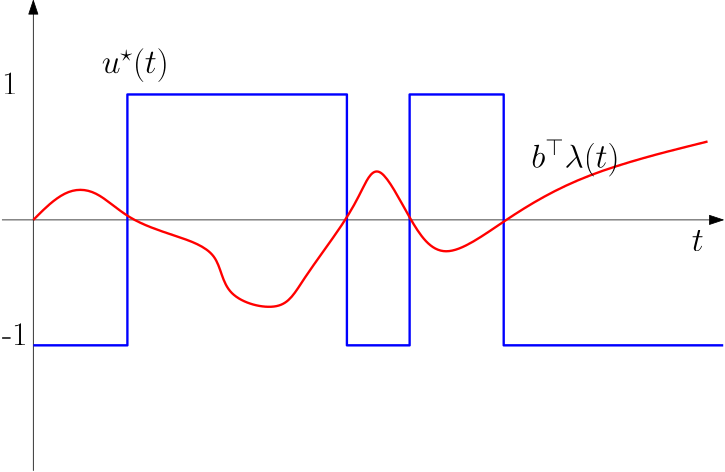
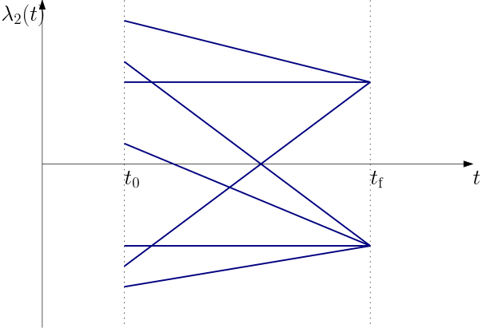

The task of bringing the system from a given state to some given final state (either a single state or a set of states) can be formulated by setting 
$$
 L = 1,
$$
which turns the cost functional to
$$
 J = \int_{t_\mathrm{i}}^{t_\mathrm{f}}1\text{d}t = t_\mathrm{f}-t_\mathrm{i}.
$$

## Time-optimal control for a linear system

We restrict ourselves to an LTI system
$$
 \dot{\bm x} = \mathbf A\bm x + \mathbf B\bm u,\qquad t_\mathrm{i} = 0, \; \bm x(t_\mathrm{i}) = \mathbf x_0, 
$$
for which we set the desired final state as 
$$
 \bm x(t_\mathrm{f}) = 0.
$$

This only makes sense if we impose some bounds on the control. We assume the control to be bounded by
$$
 |u_i(t)| \leq 1\quad \forall i, \; \forall t.
$$

The necessary conditions can be assembled immediately by forming the Hamiltonian
$$
 H = 1 + \boldsymbol\lambda^\top \,(\mathbf A\bm x+\mathbf B\bm u),
$$
and substituting into the (control) Hamilton canonical equations 
$$
\begin{aligned}
 \dot{\bm x} &= \nabla_{\boldsymbol\lambda}H = \mathbf A\bm x + \mathbf B\bm u,\\
 \dot{\boldsymbol \lambda} &= -\nabla_{\bm x}H = -\mathbf A^\top \boldsymbol \lambda.
\end{aligned}
$$
plus the Pontryagin's statement about minimization of $H$ with respect to $\bm u$
$$
H(t, \bm x^\star ,\bm u^\star ,\boldsymbol\lambda^\star ) \leq  H(t, \bm x^\star ,\bm u, \boldsymbol\lambda^\star ), \; u_i(t)\in [-1,1]\; \forall i, \; \forall t.
$$

Application of Pontryagin's principle gives
$$
1 + (\boldsymbol\lambda^\star )^\top \, (\mathbf A\bm x^\star +\mathbf B\bm u^\star ) \leq 1 + (\boldsymbol\lambda^\star )^\top \, (\mathbf A\bm x^\star +\mathbf B\bm u),\quad u_i\in [-1,1]\; \forall i, \; \forall t.
$$

Cancelling the identical terms on both sides we are left with 
$$
(\boldsymbol\lambda^\star )^\top \, \mathbf B\bm u^\star  \leq (\boldsymbol\lambda^\star )^\top \, \mathbf B\bm u,\quad u_i\in [-1,1]\; \forall i, \; \forall t.
$$

It turns out that if this inequality is to hold then with the $\bm u$ arbitrary on the left (within the bounds), the only way to guarantee the validity is to have
$$
\bm u^\star  = - \text{\textbf{sgn}}\left( (\boldsymbol\lambda^\star )^\top \, \mathbf B\right),
$$
where the signum function is applied elementwise. Clearly the optimal control is *switching* between the minimum and maximum values, which is 1 and -1. This is visualized in @fig-switching-function for a scalar case (the $\mathbf B$ matrix has only a single column).

{#fig-switching-function width=50% }

As a matter of fact, to prove this claim, we should rigorously exclude that the argument of the signum function – the *switching function* – can assume zero value for anything longer then just a time instant (although repeatedly). Here we skip the details and refer the reader to @liberzonCalculusVariationsOptimal2011 (see the *normality conditions* keyword).

### Time-optimal control for a double integrator system

Let us analyze the situation for a double integrator. This corresponds to a system described by the second Newton's law. For a normalized mass the state space model is
$$
 \begin{bmatrix}
  \dot y\\ \dot v
 \end{bmatrix}
= 
\begin{bmatrix}
 0 & 1\\ 0 & 0
\end{bmatrix}
 \begin{bmatrix}
  y\\ v
 \end{bmatrix}
+
 \begin{bmatrix}
  0\\1
 \end{bmatrix}
u.
$$

The switching function is obviously $\lambda_2(t)$ and an optimal control is given by
$$
 u(t) = -\text{sgn} \lambda_2(t).
$$

We do not know $\lambda_2(t)$. In order to get it, we may need to solve the costate equations. Indeed, we can solve them independently of the state equations since they are decopled. The costate equations are
$$
 \begin{bmatrix}
  \dot \lambda_1\\ \dot \lambda_2
 \end{bmatrix}
= 
-
\begin{bmatrix}
 0 & 0\\ 1 & 0
\end{bmatrix}
 \begin{bmatrix}
  \lambda_1\\ \lambda_2
 \end{bmatrix}
,
$$
from which it follows that 
$$
 \lambda_1(t) = c_1
$$
and 
$$
 \lambda_2(t) = -c_1t+c_2.
$$
for some constants $c_1$ and $c_2$. To determine the constants, we will have to bring the boundary conditions finally into the game. The condition that $H(t_\mathrm{f}) = 0$ gives
$$
 \lambda_2(t_\mathrm{f})u(t_\mathrm{f}) = -1.
$$
  
We can now sketch possible profiles of the switching function. A few characteristic versions are in @fig-time-optimal-costate 

{#fig-time-optimal-costate width=50%}

What we have learnt is that the costate $\lambda_2$ would go **through zero at most once** during the whole control interval. Therefore we will have at most one switching of the control signal. This is a valuable observation.

We are approaching the final stage of the derivations. So far we have learnt that we can only consider $u(t)=1$ and $u(t)=-1$. The state equations can be easily integrated to get
$$
v(t) = v(0) + ut,\quad y(t) = y(0) + v(0)t + \frac{1}{2}ut^2.
$$

To visualize this in $y-v$ domain, express $t$ from the first and subsitute into the second equation
$$
u(y-y(0)) = v(0) (v-v(0))+ \frac{1}{2}(v-v(0))^2,
$$
which is a family of parabolas parameterized by $(y(0),v(0))$. These are visualized in @fig-time-optimal-parabolas.

``` {julia}
#| label: fig-time-optimal-parabolas
#| fig-cap: "Two families of (samples of) state trajectories corresponding to the minimum and maximum control for the double integrator system. Highlighted (thick) is the switching curve (composed of two branches)."
using Plots
# Nastavení vykreslování
plot(legend=false, xlabel="y", ylabel="v")

# Parabolas for u = 1
u = 1
v0 = -3
v = -3:0.1:3

for y0 in -10:0.5:10
    y = y0 .+ v0 .* (v .- v0) .+ 1/2 .* (v .- v0).^2
    plot!(y, v, linewidth=0.5, color=:red)
end

v = -3:0.01:0
y = 1/2 .* v.^2
plot!(y, v, color=:red, linewidth=2)

annotate!(2.5, -1, text("u=1", 12, :red, halign=:right))

# Parabolas for u = -1
u = -1
v0 = 3
v = -3:0.1:3

for y0 in -10:0.5:10
    y = -y0 .- v0 .* (v .- v0) .- 1/2 .* (v .- v0).^2
    plot!(y, v, linewidth=0.5, color=:blue)
end

v = 0:0.01:3
y = -1/2 .* v.^2
plot!(y, v, color=:blue, linewidth=2)

annotate!(-1.0, 1, text("u=-1", 12, :blue, halign=:right))
```

There is a distinguished curve in the figure, which is composed of two branches. It is special in that for all the states starting on this curve, the system is brought to the origin for a corresponding setting of the control (and no further switching). This curve, called *switching curve* can be expressed as 
$$
y = \left\{
\begin{array}{cl}
\frac{1}{2}v^2 & \text{if} \; v<0\\
-\frac{1}{2}v^2 & \text{if} \; v>0
\end{array}
\right.
$$
or
$$
y = - \frac{1}{2}v|v|.
$$

The final step can be done refering to the figure. We point a finger anywhere in the state plane. We follow the state trajectory that emanates from that particular point for which we can get to the origin with at maximum 1 switching. Clearly the strategy is to set $u$ such that it brings us to the switching curve (the thick one in the figure), switch the control and then just follow the trajectory till the origin. That is it. This control strategy can be written as 
$$\boxed{
u(t) = 
\left\{
\begin{array}{cl}
-1 & \text{if } y(t)>-\frac{1}{2}v(t)|v(t)|\text{ or if } y(t)= -\frac{1}{2}v(t)|v(t)| \text{ and }v>0,\\
1 & \text{if } y(t) < -\frac{1}{2}v(t)|v(t)|\text{ or if } y(t)= -\frac{1}{2}v(t)|v(t)| \text{ and }v<0.
\end{array}
\right.}
$$

Equivalently, we can write the condition in terms of the *switching function* $s(y,v)$ defined by
$$\boxed{
s(y,v) = y + \frac{1}{2}v|v|}
$$
by checking if the function is positive or negative (or zero within some numerical tolerance, as we discuss later).

The code below implements this optimal control law.
``` {julia}
#| code-fold: show
#| output: false
using DifferentialEquations
using Plots

function time_optimal_bang_bang_control(x, umin, umax)
    y = x[1]                    # Position.
    v = x[2]                    # Velocity.
    s = y+1/2*v*abs(v)          # Switching curve s(y,v) = 0.
    if s == 0                   # If on the switching curve:
        return v >= 0 ? umin : umax
    elseif s > 0               # If above the curve:
        return umin
    else                        # If below the curve:
        return umax
    end
end

function simulate_time_optimal_double_integrator()
    A = [0 1; 0 0]
    B = [0, 1]
    umin, umax = (-1.0, 1.0)
    tspan = (0.0, 3.6)
    x₀ = [1.0,1.0]
    f(x,p,t) = A*x + B*time_optimal_bang_bang_control(x,umin,umax)
    prob = ODEProblem(f,x₀,tspan)
    xopt = solve(prob, Tsit5(), reltol=1e-8, abstol=1e-8, dtmax=0.01)
    uopt = time_optimal_bang_bang_control.(xopt.u,umin,umax)  # Remember the package uses `u` as the state variable.
    return xopt, uopt
end

xopt, uopt = simulate_time_optimal_double_integrator()
```

We plot the state trajectory in the state space in @fig-time-optimal-state-portrait. Things look fine. We can see a compliance with the fact we have derived rigorously – there is (at most) one switching.
``` {julia}
#| code-fold: true
#| fig-cap: "State trajectory of the double integrator system under time-optimal (bang-bang) feedback control in the state space. The trajectory starts at (1,1) and ends at the origin."
#| label: fig-time-optimal-state-portrait
plot(xopt[1,:],xopt[2,:],linewidth=2,xaxis="Position",yaxis="Velocity",label="State trajectory")
```

Really? We now plot the state and control trajectories as they evolve in time in @fig-time-optimal-control. 
``` {julia}
#| code-fold: true
#| fig-cap: "Response of a double integrator with a time-optimal (bang-bang) feedback control to a nonzero initial state. Chattering phenomenon is visible in the control signal as the system approaches the origin."
#| label: fig-time-optimal-control
p1 = plot(xopt,linewidth=2,xaxis="",yaxis="States",label=["y" "v"]) 
p2 = plot(xopt.t,uopt,linewidth=2,xaxis="Time",yaxis="Control",label="u")
plot(p1,p2,layout=(2,1))
```

Ooops... This is actually not quite what the theory predicted. We can see that the control variable switches for the first time at about 2.2 s, but then it switches again at time close to 3.5 s. And it then keeps switching very fast. 

Consequently, the simulation gets significantly slower and the solver may even appear to get stuck. 

This behaviour is quite characteristic of the naive implementation of bang-bang control – a phenomenon called *chattering*. 

Any suggestions for handling it, however heuristically? First, note that the condition `if s==0` is completely useless for a floating point number `s`. The condition will most likely never be satisfied. We can introduce some small insensitivity band around the switching curve. And we can also implement a stopping criterion for control once we are close enough to the origin – the control switches to zero (it would be perhaps more appropriate in practice to switch to some local controller such as LQR). This is implemented in the code below. 

``` {julia}
#| code-fold: show
#| output: false
function time_optimal_bang_bang_control(x, umin, umax; ϵₛ = 1e-3, ϵₓ = 5e-3)
    y = x[1]                    # Position.
    v = x[2]                    # Velocity.
    s = y+1/2*v*abs(v)          # Switching curve s(y,v) = 0.
    if y^2 + v^2 <= ϵₓ^2        # If close enough to the origin, stop controlling:
        return 0.0
    elseif abs(s) <= ϵₛ         # If in the band around the switching curve:
        return v >= 0 ? umin : umax
    elseif s > ϵₛ               # If above the curve, considering also the band:
        return umin
    else                        # If below the curve, considering also the band:
        return umax
    end
end
```

The resulting state and control trajectories are shown in @fig-time-optimal-control-mitigated. 
``` {julia}
#| code-fold: true
#| fig-cap: "State trajectory of the double integrator system under time-optimal (bang-bang) feedback control in the state space. The trajectory starts at (1,1) and ends at the origin. The chattering phenomenon is mitigated by introducing an insensitivity region around the switching curve and stopping the integration once the state is close enough to the origin."
#| label: fig-time-optimal-control-mitigated
function simulate_time_optimal_double_integrator()
    A = [0 1; 0 0]
    B = [0, 1]
    umin, umax = (-1.0, 1.0)
    tspan = (0.0, 3.6)
    x₀ = [1.0,1.0]
    ϵₛ = 1e-3
    ϵₓ = 5e-3
    f(x,p,t) = A*x + B*time_optimal_bang_bang_control(x, umin, umax; ϵₛ=ϵₛ, ϵₓ=ϵₓ)

    prob = ODEProblem(f,x₀,tspan)
    xopt = solve(prob, Tsit5(), reltol=1e-8, abstol=1e-8, dtmax=0.01)
    uopt = time_optimal_bang_bang_control.(xopt.u,umin,umax; ϵₛ=ϵₛ, ϵₓ=ϵₓ)  # Remember that the package uses `u` as the state variable.
    return xopt, uopt
end

xopt, uopt = simulate_time_optimal_double_integrator()

plot(xopt[1,:],xopt[2,:],linewidth=2,xaxis="Position",yaxis="Velocity",label="State trajectory")

p1 = plot(xopt,linewidth=2,xaxis="",yaxis="States",label=["y" "v"]) 
p2 = plot(xopt.t,uopt,linewidth=2,xaxis="Time",yaxis="Control",label="u")
plot(p1,p2,layout=(2,1))
```

:::{.callout-warning}
Note that the video linked below, which covers the material of this lecture, uses the other convention for the control Hamiltonian, the one leading to the maximization of the Hamiltonian. Other than that, the (structure of the) results is the same.
:::

