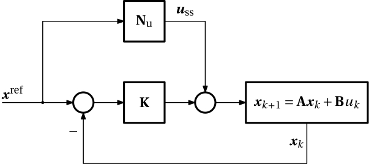
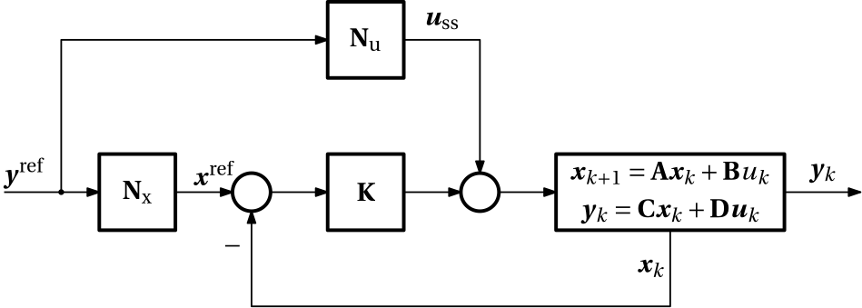
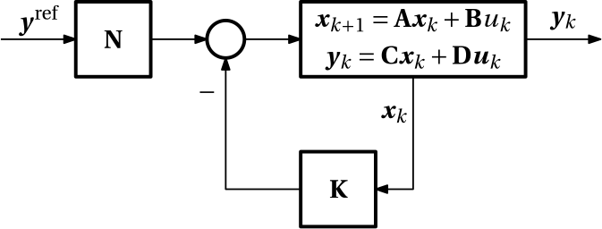
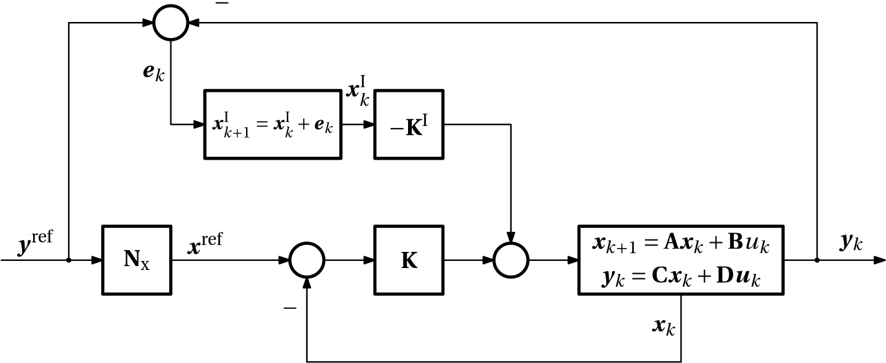

## Reference state tracking using LQR
Instead of controlling (regulating) the system to the origin (zero state), we may want to control it to some nonzero reference state $\mathbf x^\mathbf{ref}\neq 0$. The immediate idea might be that the cost function then changes to
$$\boxed{
J(\ldots) = \frac{1}{2} \sum_{k=0}^{N} \left((\bm x_{k}-{\color{blue}\mathbf x^\mathrm{ref}})^\top \mathbf Q \, (\bm x_{k}-{\color{blue}\mathbf x^\mathrm{ref}}) + \bm u_{k}^\top \mathbf R \bm u_{k}\right).}
$${#eq-LQR-tracking-cost-function-finite-horizon}

While this is perfectly reasonable, it is also true that as soon as we extend the time horizon to infinity, that is, for the cost function  
$$
J(\ldots) = \frac{1}{2} \sum_{k=0}^{\infty} \left((\bm x_{k}-{\color{blue}\mathbf x^\mathrm{ref}})^\top \mathbf Q \, (\bm x_{k}-{\color{blue}\mathbf x^\mathrm{ref}}) + \bm u_{k}^\top \mathbf R \bm u_{k}\right).
$$
then unless the nonzero reference state is an equilibrium, the control needed to keep the system at the corresponding state is nonzero, and the cost function will then be unbounded. 

Namely, for a general discrete-time linear system with a control input, described by the state equation
$$
\bm x_{k+1} = \mathbf A \bm x_k + \mathbf B \bm u_k,
$${#eq-discrete-time-linear-state-equation}
at an equilibrium (a steady state) $\mathbf x^\mathrm{ss}$, the following must be satisfied
$$
\bm x^\mathrm{ss} = \mathbf A \bm x^\mathrm{ss} + \mathbf B \bm u^\mathrm{ss},
$$
which we can rearrange as
$$
(\mathbf A - \mathbf I) \bm x^\mathrm{ss} + \mathbf B \bm u^\mathrm{ss} = \mathbf 0.
$${#eq-steady-state-equation}

Fixing the value of the steady state vector $\bm x^\mathrm{ss}$ to $\mathbf x^\mathrm{ref}$, we can obtain the corresponding steady state control $\bm u^\mathrm{ss}$ by solving
$$
\mathbf B \bm u^\mathrm{ss} = (\mathbf I - \mathbf A) \mathbf x^\mathrm{ref},
$$
from which we can express the solutions $\bm u^\mathrm{ss}$ as
$$
\bm u^\mathrm{ss} = \underbrace{\mathbf B^\dagger (\mathbf I - \mathbf A)}_{\mathbf N_\mathrm{u}} \mathbf x^\mathrm{ref},
$${#eq-steady-state-control}
where $\mathbf B^\dagger$ is the pseudo-inverse of $\mathbf B$. It is also useful to notice that the steady state control $\bm u^\mathrm{ss}$ is a linear function of the reference steady state $\mathbf x^\mathrm{ref}$, here represented by the matrix coefficient $\mathbf N_\mathrm{u}$.

It is worth emphasizing that unless the desired steady state $\bm x^\mathrm{ref}$ is in the null space of $(\mathbf A - \mathbf I)$, the corresponding steady-state control is nonzero. It then it makes no sense to penalize the control itself. Instead, the deviation of the control from the computed steady-state nonzero value can be penalized. The new cost function is then 
$$\boxed{
J(\ldots) = \frac{1}{2} \sum_{k=0}^{\infty} \left((\bm x_{k}-{\color{blue}\mathbf x^\mathrm{ref}})^\top \mathbf Q \, (\bm x_{k}-{\color{blue}\mathbf x^\mathrm{ref}}) + (\bm u_{k}-{\color{red}\bm u^\mathrm{ss}})^\top \mathbf R \bm (u_{k}-{\color{red}\bm u^\mathrm{ss}})\right).}
$${#eq-LQR-tracking-cost-function-infinite-horizon}

Now, subtracting the steady state equation
$$
\bm x^\mathrm{ref} = \mathbf A \bm x^\mathrm{ref} + \mathbf B \bm u^\mathrm{ss}
$$
from @eq-discrete-time-linear-state-equation, we get
$$
\bm x_{k+1} - \bm x^\mathrm{ref} = \mathbf A (\bm x_k - \bm x^\mathrm{ref}) + \mathbf B (\bm u_k - \bm u^\mathrm{ss}).
$$

Introducing the notation
$$
\delta \bm x_k = \bm x_k - \mathbf x^\mathrm{ref}, \quad \delta \bm u_k = \bm u_k - \bm u^\mathrm{ss},
$$
we can rewrite the above equation as
$$
\delta \bm x_{k+1} = \mathbf A \delta \bm x_k + \mathbf B \delta \bm u_k,
$$
which is the same as the original state equation, but with the state and control replaced by their deviations from the reference values. Accordingly, the cost function can be rewritten as
$$
J(\ldots) = \frac{1}{2} \sum_{k=0}^{\infty} \left(\delta \bm x_{k}^\top \mathbf Q \, \delta \bm x_{k} + \delta \bm u_{k}^\top \mathbf R \delta \bm u_{k}\right).
$$  

For this we solve the standard LQR problem. When writing down the optimal control law, we must remember to add the steady state control $\bm u^\mathrm{ss}$ back to the optimal control deviation $\delta \bm u_k$:
$$\boxed{
\bm u_k = -\mathbf K (\bm x_k - \mathbf x^\mathrm{ref}) + \bm u^\mathrm{ss},}
$$
where $\mathbf K$ is the optimal gain matrix for the original problem. In other words, the optimal control law for the tracking problem is the same as the optimal control law for the regulation problem, but with the state and control replaced by their deviations from the reference values, and with an additional feedforward term $\bm u^\mathrm{ss}$ that accounts for the nonzero reference state.

Recalling from @eq-steady-state-control that $\bm u^\mathrm{ss}$ is a linear function of $\mathbf x^\mathrm{ref}$, we can also visualize the structure of the controller as in @fig-reference_state_LQ_tracking.

{#fig-reference_state_LQ_tracking width=50%}

## Reference output tracking using LQR
If instead of the reference state (vector) variable, the output variable is to be tracked, we need to make a minor modification to the above scheme. First, the model of the plant must also contain the output equation. For convenience, we assume no direct feedthrough term :
$$
\bm y_k = \mathbf C \bm x_k,
$$
but it is straightforward to extend the scheme to the case with direct feedthrough. The cost function must be modified to penalize the deviation of the output from the reference output $\mathbf y^\mathrm{ref}$ instead of the deviation of the state from the reference state $\mathbf x^\mathrm{ref}$:
$$
J(\ldots) = \frac{1}{2} \sum_{k=0}^{\infty} \left((\bm y_{k}-\mathbf y^\mathrm{ref})^\top \mathbf Q_\mathrm{y} \, (\bm y_{k}-\mathbf y^\mathrm{ref}) + (\bm u_{k}-\bm u^\mathrm{ss})^\top \mathbf R \bm (u_{k}-\bm u^\mathrm{ss})\right)
$$

The reference output $\mathbf y^\mathrm{ref}$ and the reference state $\bm x^\mathrm{ref}$ are related by the output equation at steady state
$$
\mathbf y^\mathrm{ref} = \mathbf C \bm x^\mathrm{ref}.
$${#eq-steady-state-output-equation}

Combined with the previously provided equation for the steady state control $\bm u^\mathrm{ss}$, we can write the two conditions compactly as the following system of linear equations
$$
\begin{bmatrix}\mathbf A - \mathbf I & \mathbf B \\
\mathbf C & \mathbf 0 \end{bmatrix} \begin{bmatrix}\bm x^\mathrm{ref} \\ \bm u^\mathrm{ss} \end{bmatrix} = \begin{bmatrix}\mathbf 0 \\ \mathbf y^\mathrm{ref} \end{bmatrix}.
$$

From this, can write the cost function as
$$ 
J(\ldots)= \frac{1}{2} \sum_{k=0}^{\infty} \left((\bm x_{k}-\bm x^\mathrm{ref})^\top \underbrace{\mathbf C^\top\mathbf Q_\mathrm{y} \mathbf C}_{\mathbf Q}\, (\bm x_{k}-\bm x^\mathrm{ref}) + (\bm u_{k}-\bm u^\mathrm{ss})^\top \mathbf R (\bm u_{k}-\bm u^\mathrm{ss})\right).
$$

From the steady-state output equation @eq-steady-state-output-equation, we can solve for the reference state $\bm x^\mathrm{ref}$ as 
$$
\bm x^\mathrm{ref} = \mathbf C^\dagger \mathbf y^\mathrm{ref},
$$
where $\mathbf C^\dagger$ is the pseudo-inverse of $\mathbf C$. We denote $\mathbf N_\mathrm{x} \coloneqq \mathbf C^\dagger$. Now, we combine with the fact that the steady-state control is also linearly dependent on the reference
$$
\bm u^\mathrm{ss} = \mathbf N_\mathrm{u} \mathbf y^\mathrm{ref}
$$ 
and we can write compactly
$$
\begin{bmatrix}\mathbf A - \mathbf I & \mathbf B \\
\mathbf C & \mathbf 0 \end{bmatrix}\begin{bmatrix}\mathbf N_\mathrm{x} \\ \mathbf N_\mathrm{u}\end{bmatrix} = \begin{bmatrix}\mathbf 0 \\ \mathbf I \end{bmatrix}, 
$$
from which we can solve for the matrices $\mathbf N_\mathrm{x}$ and $\mathbf N_\mathrm{u}$, and then using these matrices we can find the reference state $\bm x^\mathrm{ref}$ and the steady-state control $\bm u^\mathrm{ss}$, both corresponding to the provided reference value of the output $\mathbf y^\mathrm{ref}$.

We can now visualize the overall control scheme using the block diagram in @fig-reference_output_LQ_tracking. 

{#fig-reference_output_LQ_tracking width=60%}

The control law is given by
$$
\bm u_k = -\mathbf K (\bm x_k - \mathbf N_\mathrm{x}\mathbf y^\mathrm{ref}) + \mathbf N_\mathrm{u}\mathbf y^\mathrm{ref},
$$
which can be expanded to
$$
\bm u_k = -\mathbf K \bm x_k + \underbrace{(\mathbf K \mathbf N_\mathrm{x} + \mathbf N_\mathrm{u})}_{\mathbf N}\mathbf y^\mathrm{ref}, 
$$
and this, in turn, can be represented using a block diagram in @fig-reference_output_LQ_tracking_2.

{#fig-reference_output_LQ_tracking_2 width=45%}

Before concluding, we should note that upon transforming the reference utput tracking problem into the reference state tracking problem, which in turn is transformed into the regulation problem, all on the infinite time horizon, we must not forget to check the detectability (or even better observability) of the system modelled by $(\mathbf A, \sqrt{\mathbf C^\top\mathbf Q_\mathrm{y}\mathbf C)}$. We illustrate this using the following example.

:::{#exm-LQR-output-tracking}
### Reference output tracking on an infinite time-horizon

Two masses interconnected with a spring and a damper. The first mass is also connected to a fixed wall via a spring and a damper. Modelled by a fourth-order state-space model with one control input (force acting on the first mass) and one output (the position of the second mass).
```{julia}
#| code-fold: show
#| output: false
using ControlSystems
using LinearAlgebra
using Plots

# System parameters
m₁ = 1      # Mass 1
m₂ = 0.1    # Mass 2
b₁₂ = 0.03  # Damping coefficient between the two masses
k₁₂ = 0.09  # Spring stiffness between the two masses
b₀₁ = 0.3   # Damping coefficient between the first mass and the wall
k₀₁ = 0.5   # Spring stiffness between the first mass and the wall

# State vector: x = [y'; y; d'; d], 
# where y is the position of the first mass, and d is the position of the second mass.
A = [-(b₁₂+b₀₁)/m₁ -(k₁₂+k₀₁)/m₁ b₁₂/m₁ k₁₂/m₁;
    1 0 0 0;
    b₁₂/m₂ k₁₂/m₂ -b₁₂/m₂ -k₁₂/m₂;
    0 0 1 0]
B = [1/m₁; 0; 0; 0]         # The force (the control input) acts on the first mass.
C = [0 0 0 1]               # We want to control the position of the second mass, d.
D = [0]

G = ss(A, B, C, D)
h = 0.1                     # Sampling time
Gd = c2d(G, h)
A, B, C, D = ssdata(Gd)     # Rewriting the original matrices by those correspoinding to the discretized system

N = [A-I B; C 0]\[0; 0; 0; 0; 1]
Nₓ = N[1:4]
Nᵤ = N[5]

# Setting up the cost function
Q_y = 10.0 
Q = C'*Q_y*C
rank(obsv(A,Q))             # Check the observability of the system with the new Q matrix. Should be 4.
R = 1.0

# Solving the LQR problem
K = lqr(Discrete, A, B, Q, R)

# Introduce the reference into the state feedback scheme
y_ref(t) = 1.0(t>=1.5)          # Reference output (step function starting at t=1.5)
N = K*Nₓ .+ Nᵤ                  # Dot needed here because K*Nₓ is a 1x1 matrix, while Nᵤ is a scaler.
u(x,t)  = -K*x .+ N*y_ref(t)    # Control law (u is a function of t and x)

# Simulate the closed-loop system
t = 0:h:15                      # Time vector
x0 = [0, 0.0, 0, 0.0]           # Initial condition
res = lsim(G,u,t,x0=x0)         # Simulation results
```

We explicitly show here that the system is observable with the new $Q$ matrix:
```{julia}
#| code-fold: false
rank(obsv(A,Q))                 # The square root is not even needed
```

Finally, we plot the simulation results in @fig-lqr-output-tracking.
```{julia}
#| code-fold: true
#| fig-cap: "Reference output tracking using LQR. Unit step in the reference value of the output occurs at time 1.5."
#| label: fig-lqr-output-tracking
p1 = plot(res, ylabel="Tracked output", lab="d", ploty=true, plotx=false, plotu=false, layout=1, sp=1, lw=2, seriestype=:steppost, color=palette(:default)[4])
plot!(t, y_ref.(t), lab="reference", lw=2, ls=:dash, layout=(3,1), sp=1, seriestype=:steppost)
p2 = plot(res, ylabel="State", lab=["y dot" "y" "d dot" "d"], ploty=false, plotx=true, plotu=false, layout=1, sp=1, lw=2, seriestype=:steppost, legend_position = :topright)
p3 = plot(res, ylabel="Control", lab="u", ploty=false, plotx=false, plotu=true, layout=1, sp=1, lw=2, seriestype=:steppost)
plot(p1, p2, p3, layout=(3,1))
```
:::

## Reference output tracking using LQI

The acronym *LQI* stands for *Linear Quadratic Integral* control. The idea is to introduce an integral action to the LQR controller to eliminate steady-state errors in tracking problems. This is achieved by augmenting the state vector with an integral of the tracking error. Namely, we define a new component of the state vector will be updated according to 
$$
\bm x_{k+1}^\mathrm{I} = \bm x_{k}^\mathrm{I} + \underbrace{(\mathbf y^\mathrm{ref}-\mathbf C \bm x_k)}_{\bm e_k},
$$
which can be combined with the original state equation to form an augmented state-space model
$$
\begin{bmatrix}\bm x_{k+1} \\ \bm x_{k+1}^\mathrm{I}\end{bmatrix} = \underbrace{\begin{bmatrix}\mathbf A & \mathbf 0 \\ -\mathbf C & \mathbf I \end{bmatrix}}_{\mathbf A^\mathrm{aug}} \begin{bmatrix}\bm x_k \\ \bm x_k^\mathrm{I}\end{bmatrix} + \underbrace{\begin{bmatrix}\mathbf B \\ \mathbf 0\end{bmatrix}}_{\mathbf B_\mathrm{u}^\mathrm{aug}} \bm u_k + \underbrace{\begin{bmatrix}\mathbf 0 \\ \mathbf I\end{bmatrix}}_{\mathbf B_\mathrm{y}^\mathrm{aug}} \mathbf y^\mathrm{ref}.
$$

{#fig-reference_output_LQI_tracking width=70%}

The control law is given by
$$\boxed{
\bm u_k = - \begin{bmatrix}\mathbf K & \mathbf K^\mathrm{I}\end{bmatrix} \begin{bmatrix}\bm x_k \\ \bm x_k^\mathrm{I}\end{bmatrix} + \mathbf K \mathbf N_\mathrm{x} \mathbf y^\mathrm{ref}.}
$$

It is worth noting that the (discrete-time approximation of the) integrator serves the very much similar role as the feedforward term $\bm u^\mathrm{ss}$ does in the scheme of @fig-reference_output_LQ_tracking – it provides the constant offset to the control even if the regulation error is zero.

::: {#exm-LQI-tracking}
### Reference output tracking using LQI
We consider the same system as in the previous example, but now we introduce an integral action to the controller. 

``` {julia}
#| code-fold: show
#| output: false

using ControlSystems
using LinearAlgebra
using Plots

# System parameters
m₁ = 1      # Mass 1
m₂ = 0.1    # Mass 2
b₁₂ = 0.03  # Damping coefficient between the two masses
k₁₂ = 0.09  # Spring stiffness between the two masses
b₀₁ = 0.3   # Damping coefficient between the first mass and the wall
k₀₁ = 0.5   # Spring stiffness between the first mass and the wall

# State vector: x = [y'; y; d'; d], 
# where y is the position of the first mass, and d is the position of the second mass.
A = [-(b₁₂+b₀₁)/m₁ -(k₁₂+k₀₁)/m₁ b₁₂/m₁ k₁₂/m₁;
    1 0 0 0;
    b₁₂/m₂ k₁₂/m₂ -b₁₂/m₂ -k₁₂/m₂;
    0 0 1 0]
B = [1/m₁; 0; 0; 0]         # The force (the control input) acts on the first mass.
C = [0 0 0 1]               # We want to control the position of the second mass, d.
D = [0]

G = ss(A, B, C, D)
h = 0.1                     # Sampling time
Gd = c2d(G, h)
A, B, C, D = ssdata(Gd)     # Rewriting the original matrices by those correspoinding to the discretized system

Nₓ = pinv(C)

# Building the augmented system for integral control
A_aug = [A zeros(4,1); -C 1]
B_u_aug = [B; zeros(1,1)]
B_y_aug = [zeros(4,1); 1]  
C_aug = [C zeros(1,1)]
D_aug = [0 0] 
G_aug = ss(A_aug, [B_u_aug B_y_aug], C_aug, D_aug, h)

#Weights for the LQR controller
Q_aug = 1.0* Matrix(I, 5, 5)
Q_aug[1,1] = 1
Q_aug[2,2] = 1
Q_aug[3,3] = 1
Q_aug[4,4] = 1
Q_aug[5,5] = 0.02           # Penalize the integral of the error as well
R = 1.0

# Design the LQR controller for the augmented system
K_aug = lqr(Discrete, A_aug, B_u_aug, Q_aug, R)
K = K_aug[:, 1:4]
Kᵢ = K_aug[:, 5:end] 
y_ref(t) = t >= 1.5 ? 1.0 : 0.0         # Reference output (step function starting at t=1.5)      
u(x_aug, t) = (-K*x_aug[1:4] - Kᵢ*x_aug[5] + K*Nₓ*y_ref(t))[1]  # Without the [1] at the end, u would be a 1x1 matrix.
uy(x_aug, t) = [u(x_aug, t), y_ref(t)]  # The first column is the control input, and the second column is the output reference. This is needed for simulating the augmented system.

# Simulate the closed-loop system
t = 0:h:15
x0 = [0, 0.0, 0, 0.0]       # Initial values of the original (physical) state variables.
xᵢ0 = [0.0]                 # Initial value of the integral-of-the-tracking-error state variable. 
y, t, x, uout = lsim(G_aug, uy, t, x0=vcat(x0, xᵢ0)) 
```

Finally we plot the results in @fig-lqi-output-tracking.

```{julia}
#| code-fold: true
#| fig-cap: "Reference output tracking using LQI. Unit step in the reference value of the output occurs at time 1.5."
#| label: fig-lqi-output-tracking
p1 = plot(t, y', ylabel="Tracked output", lab="d", lw=2, seriestype=:steppost, color=palette(:default)[4])
plot!(t, y_ref.(t), lab="reference", lw=2, ls=:dash, seriestype=:steppost)
p2 = plot(t, x[1:4,:]', ylabel="State", lab=["y dot" "y" "d dot" "d"], lw=2, seriestype=:steppost, legend_position = :topright)
p3 = plot(t, x[5,:], ylabel="State xᵢ", lab="xᵢ", lw=2, seriestype=:steppost)
p4 = plot(t, uout[1,:], ylabel="Control", lab="u", lw=2, seriestype=:steppost, xlabel="Time")
plot(p1, p2, p3, p4, layout=(4,1))
```
:::