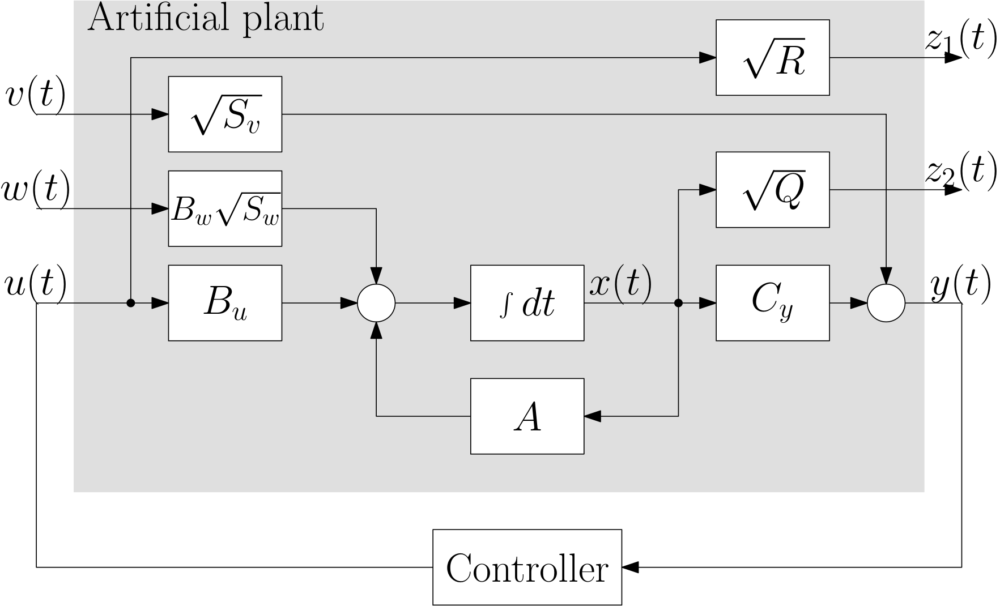
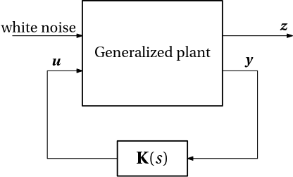

We are now going to do the same as we did it while discussing the LQR control for a system with stochastic disturbances. We have seen that the optimal control problem of minimizing the expected value of an integral quadratic cost can be reformulated as a problem of minimizing the $\mathcal{H}_2$ system norm of a certain interconnection of the system and the controller. This is illustrated in @fig-LQG_as_H2.

{#fig-LQG_as_H2 width=55%}  

The generalized plant (the gray block in the figure) has

- two types of inputs: 
  - exogenous input, here composed of the random disturbance $w(t)$ and the measurement noise $v(t)$, both modelled as white noise,
  - control input $u(t)$, 
- two types of outputs: 
  - regulated outputs to be regulated (close) to zero, here the two variables $z_1(t)$ and $z_2(t)$, 
  - measured outputs $y(t)$.

Having seen another instance of this reformulation, we now formulate the $\mathcal{H}_2$-optimal control problem in full generality. For the feedback interconnection of a generalized plant $\mathbf P$ and a controller $\bm K$ as in @fig-H2-optimal-control, we want to find the controller that minimizes the $\mathcal{H}_2$ norm of the closed-loop transfer function from the exogenous inputs $\bm w$ to the regulated outputs $\bm z$.

{#fig-H2-optimal-control width=35%}

Denoting the closed-loop transfer function as $\mathbf N(\mathbf P, \bm K)$, the optimal control problem is then given by
$$\boxed{
\operatorname*{minimize}_{\bm K(s)\text{ stabilizing}}\|\mathbf N(\mathbf P, \bm K)\|_{2}
}
$$

To conclude, while our main approach towards optimal control design so far has been to **minimize the integral of some functions of the states and the control inputs**, we have just seen that 
such problem can be reformulated as the **minimization of the $\mathcal H_2$ norm of a feedback interconnection** of a special artificial/auxiliary/**generalized system** and the feedback controller.

While this reformulation by itself may open some new perspectives on the problem, it also opens the door to a whole new family of optimal control problems that are defined by using other system norms instead of the $\mathcal H_2$ norm. We will see some of these problems in the next lectures.