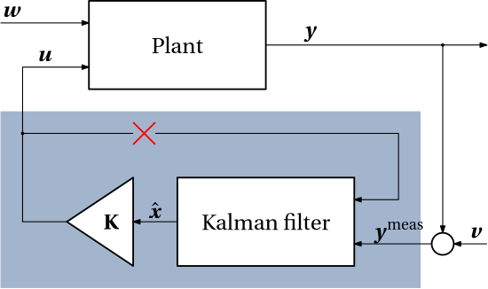
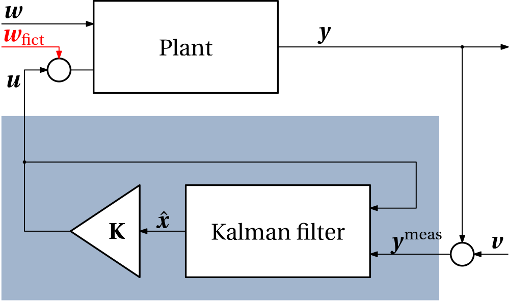

We have learned that LQG controllers can be arbitrarily non-robust (low gain or phase margins). Note that unlike an LQR controller that only relies on the availability of the measurements of the state, an LQG controller relies (through its internal Kalman filter) on knowing the control input as well. The Kalman filter combines this knowledge of the control input with the model of the system to predict the state (and correct this prediction using the measurements of the system output). But if the model is not accurate enough, the estimate may be poor. We can view this situation with an innacurate model as if the control input reported to the Kalman filter was different from the control input actually applied to the system.

One heuristic idea how to mitigate this weakness of the LQG control is to make it similar to the LQR control by reducing its dependence of the accuracy of the knowledge of the control variable. This heuristic idea is formalized under the name or Loop Transfer Recovery (LTR), and it is symbolically illustrated in @fig-ltr.


{#fig-ltr width=50%}

But how can we enforce this behavior upon the LQG controller? We can introduce a fictitious noise $\bm w_\mathrm{fict}(t)$ during the computatonal design (not in the operation!) that enters the system in the same way as the control signal, see @fig-ltr2. In this way, we model the inaccuracy of the model as a corruption of the control input.

{#fig-ltr2 width=50%}

The state equation of the system used for the LQG design is then given by

$$
\begin{aligned}
 \dot{\bm{x}}(t) &= \mathbf A\bm x(t) + \mathbf B_u\bm u(t) + \mathbf B_w\bm w(t) + \mathbf B_u{\color{red}\bm w_\mathrm{fict}(t)}\\
           &= \mathbf A\bm x(t) + \mathbf B_u\bm u(t) + \begin{bmatrix}\mathbf B_w & \mathbf B_u\end{bmatrix}\begin{bmatrix}\bm w(t)\\{\color{red}\bm w_\mathrm{fict}(t)}\end{bmatrix}
\end{aligned}
$$

The spectral density of the new fictitious disturbance modelled as white noise is
$$
\mathbf S = \begin{bmatrix}\mathbf S_w & 0\\ 0 & {\color{red}S_{w_{\mathrm{fict}}}}\mathbf I\end{bmatrix}
$$

It is this fictitious noise spectral density $S_{w_{\mathrm{fict}}}$ that we can tune to make the Kalman filter rely less on the knowledge of the control signal. By increasing it, we make the control less sensitive to the modelling errors.   

::: {#exm-ltr-robot-arm}
### LQG/LTR for a robot arm
A single-link robotic arm is to be held vertical. Its model is
$$
J\ddot{\theta}(t) = mg\sin\theta(t) + u(t).
$$

Linearizing and substituting some values for the parameters yields
$$
\begin{bmatrix}
 \dot\theta \\ \ddot\theta
\end{bmatrix}
=
\begin{bmatrix}
 0 & 1\\ 0.5 & 0
\end{bmatrix}
\begin{bmatrix}
 \theta \\ \dot\theta
\end{bmatrix}
+
\begin{bmatrix}
 0 \\ 0.1
\end{bmatrix}
u
+
\begin{bmatrix}
 0 \\ 0.1
\end{bmatrix}
w,
$$
where $w$ is a random disturbance by a torquer circuit with a spectral density $S_w = 1$. 

The angle of the arm is measured, which is modelled using the output equation
$$
y(t) = 
\begin{bmatrix}
 1 & 0
\end{bmatrix}
\begin{bmatrix}
 \theta \\ \dot \theta
\end{bmatrix}
+v,
$$
where the measurement noise spectral density is $S_v=1$. 

The cost function that we choose for the LQG design is
$$
J = \mathbf E\left\{\theta^2 + 16u^2\right\}.
$$

``` {julia}
#| code-fold: show
using ControlSystems
using LinearAlgebra
using MatrixEquations: arec
using Plots
using PrettyTables

# Plant model
A  = [0.0 1.0; 0.5 0.0]
Bu = [0.0; 0.1]
Bw = [0.0; 0.1]
C  = [1.0 0.0]

# Noise spectral densities
Sw = 1.0    # Actual disturbance
Sv = 10.0   # Measurement noise

# LQR gain (fixed across all designs)
Q = Diagonal([1.0, 0.0])
R = 16.0
K = lqr(A, Bu, Q, R)

# Plant state-space model
G = ss(A, Bu, C, 0.0)

# Build open-loop transfer function L(S) = C(s)·G(s) for negative-feedback stability margin analysis.
# Sw_fict = 0 gives pure LQG; increasing Sw_fict drives LTR recovery.
function open_loop(Sw_fict)
    L = kalman(Continuous, A, C, Bw*Sw*Bw' + Bu*Sw_fict*Bu', Sv)    # Kalman filter gain.
    #P, _ = arec(A', C' / Sv * C, Bw_cov)                           # Alternatively, we can solve CARE
    #L = P * C' / Sv                                                #  to compute the Kalman filter gain.
    Klqg  = ss(A - L*C - Bu*K, L, K, zeros(size(K,1), size(C,1)))   # Observer-controller (to be pluggeded into a negative .feedback loop)
    return Klqg*G                                                   # Open-loop transfer function.
end

# Designs to compare
Sw_fict_values = [0.0, 1e4, 1e6]
labels = vcat("LQG", ["LTR (Sw_fict=$(Int(Sw_fict_values[i])))" for i in 2:length(Sw_fict_values)])

# Compute open-loop TFs and collect stability margins
OL_array = []
table_data = Matrix{Any}(undef, length(Sw_fict_values), 5)
for (i, (Sw_fict_value, lab)) in enumerate(zip(Sw_fict_values, labels))
    OL = open_loop(Sw_fict_value)
    push!(OL_array, OL)
    wgm, gm, wpm, pm = margin(OL, allMargins=false)
    table_data[i, :] = [lab, round(20log10(only(gm)), digits=2), round(only(wgm), digits=4),
                             round(only(pm), digits=2),  round(only(wpm), digits=4)]
end
pretty_table(table_data;
    column_labels = ["Design", "GM (dB)", "ωgm (rad/s)", "PM (°)", "ωpm (rad/s)"],
    alignment = [:l, :r, :r, :r, :r])
```

We can see that although the GM of the pure LQG design is acceptable, the PM is rather low. By increasing the fictitious noise spectral density, both GM and PM are improving with respect to the pure LQG design. 

Bode plots (magnitude and phase) for open-loop transfer functions for two designs (LQG and LTR with the largest fictitious noise spectral density) are shown in @fig-ltr-marginplot. These only confirm/visualize the results in the above table, namely that the LTR improves both gain and phase margin with respect to the pure LQG design.

```{julia}
#| fig-cap: "Bode plots for the LQG- and the LTR-controlled robotic arm."
#| label: "fig-ltr-marginplot"

ω = logrange(1e-3, 1e4, length=500)
p_lqg = marginplot(OL_array[1], ω, title="Stability margins – LQG", lw=2)
p_ltr = marginplot(OL_array[end], ω, title="Stability margins – LTR (Sw_fict=$(Sw_fict_values[end]))", lw=2)
display(plot(p_lqg, p_ltr, layout=(1,2)))
```

Nyquist plots for the several designs are shown in @fig-ltr-nyquist. We can see that, indeed, with the increasing fictitious noise spectral density, both GM and PM are improving with respect to the pure LQG design.
``` {julia}
#| code-fold: true
#| fig-cap: "Nyquist plots for the LQG/LTR-controlled robotic arm for increasing values of the fictitious noise spectral density."
#| label: "fig-ltr-nyquist"

pn = nyquistplot(OL_array[1], ω, label=labels[1], lw=2, hover=false)
for (OL, lab) in zip(OL_array[2:end], labels[2:end])
    nyquistplot!(pn, OL, ω, label=lab, xlabel="Re", ylabel="Im", lw=2, unit_circle=true, aspect_ratio=:equal, hover=false)
end
display(pn)
```

However, we can also see in @fig-ltr-nyquist that since the open loop has one unstable open-loop pole, stability of the closed loop requires exactly one counter-clockwise encirclement of the critical point −1. And this implies in the particular setting that not only $\text{GM}^+ > 1$ but also $\text{GM}^- < 1$ must be considered. Unfortunately, it appears that the margin function in ControlSystems.jl currently only returns the positive gain margin $\text{GM}^+$. Anyway, the conlcusion that the LTR design improves the robustness of the LQG design is still valid.
:::